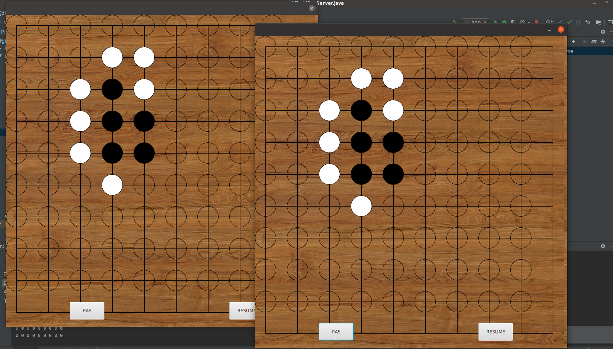

# Go Game

## Table of contents
* [Introduction](#Introduction)
* [General Info](#general-info)
* [Details](#details)
* [Code Example](#code-example)
* [Application operation process](#application-operation-process)
* [Launch](#launch)
* [Installation](#installation)
* [Design Patterns](#design-patterns)
* [Technologies](#technologies)


## Introduction
A system for conducting games in the Go game.
In general, the game is about two players competing,
 where the second can also be BOT.
The goal is to seize as much territory and
crushing as many enemy stones as possible - capturing prisoners.
A detailed description of the principles and functionalities can be found in the TPlab04.pdf.

## General Info
The application was written in Java and is based on the Client-Server architecture.
The GUI is written in Jaview Java FX technology.
The server verifies the correctness of movements and mediates communication.
The application also allows you to play with Bot, who makes quite sensible moves.
The bot searches for an opponent's group on the board with as few breaths as possible and tries to suppress and surround this one. At the same time, he observes his own stones (pawns), and if he notices the reduction of his own breathing in subsequent moves, he tries to expand the group by joining the group attacked by the opponent. (In fact, it is quite hard to win with him)
The application is open to further development of functionality. The player uses the client application to connect to the server to join the game and play the game.

## Code Example
```java
public class Server {
    public static void main(String[] args) throws Exception {
        try (var listener = new ServerSocket(58901)) {
            System.out.println("MP is running");
            var pool = Executors.newFixedThreadPool(200);
            while (true) {
                Gamee game = new Gamee();
                Game gam = new Game(size);
                pool.execute(game.new Player(listener.accept(), PlayerColor.BLACK, gam));
                pool.execute(game.new Player(listener.accept(), PlayerColor.WHITE, gam));
            }
        }
    }
}
```

## Application operation process
The server is initially created and the player's window is opened,
 in which we choose the mode and size of the board.
The player window is a Singleton and is created using the Factory pattern.
 It consists of a board - fields and a few buttons that the server listens to. The player makes a move, the correctness of which is verified by the Server and allows the next player to move or not.
  With each move, the board is refreshed to update.
History is being updated. On its basis, we check whether there
 has been a KO or the player is not trying to make a prohibited move -
  suicide. If he has reached this point (a new stone), put it on 
  the board and check if he has eliminated any of the enemy's groups. 
  If the opponent's group has zero breaths, it means that it has been 
  destroyed and you need to add points for the player, then change the 
  player, etc. You can also put state on pass or
 surrender, then give up or give away accordingly.

## Launch
Firstly compile server and then run it.
```shell script
javac Server.java && java Server
```
Start the game
```shell script
javac App.java && java App size
```
where size must be in list [9, 13, 19]
## Installation
Please, Install using pom.xml file with maven.

## Design Patterns
- singleton
- state
- observer
- builder 
- factory method

## Technologies
- java
- javafx
- junit5


